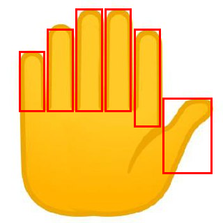

# Vision Sandbox 🔭

Agentic Vision via Gemini's native Python code execution sandbox.

Instead of just "guessing" what's in an image, the model writes and executes Python code in a Google-hosted sandbox to verify spatial relationships, count objects, or perform complex visual reasoning with pixel-level precision.

## Use Cases

- **Spatial Grounding:** Get precise [x, y] coordinates for UI elements
- **Visual Calculation:** Let the model use Python to calculate values from visual data
- **UI Auditing:** Automatically check for overlaps, alignment, and accessibility
- **Counting & Logic:** Solve visual counting tasks with code verification

## Prerequisites

- [uv](https://github.com/astral-sh/uv) (Python package manager)
- Python 3.11
- `GOOGLE_API_KEY` set in your environment

## Installation

```bash
git clone https://github.com/johanesalxd/vision-sandbox.git
cd vision-sandbox
uv sync
```

## Usage

```bash
# Basic
uv run vision-sandbox --image "path/to/image.png" --prompt "Count the items."

# Spatial grounding
uv run vision-sandbox --image "screenshot.png" --prompt "Locate the Submit button. Use code execution to verify its center point and return [x, y] coordinates in [0, 1000] scale."

# Custom model
uv run vision-sandbox --image "image.png" --prompt "Analyze this." --model gemini-3.5-flash
```

## Flags

| Flag | Default | Notes |
|---|---|---|
| `--image` / `-i` | — | Path to input image (required) |
| `--prompt` / `-p` | — | Instruction for the model (required) |
| `--model` / `-m` | `gemini-3.5-flash` | Model ID |

## Output

The model prints sandbox code, execution results, and its final response. Any images generated by the sandbox are saved as `sandbox_output_N_N.png` in the working directory.

### Example

```bash
uv run vision-sandbox \
  --image "sample/how-many-fingers.png" \
  --prompt "Count the number of fingers. Use code execution to identify the bounding box for each finger and return the total count."
```



## Agent Skill

This repo includes a `SKILL.md` for use with AI coding agents (Claude Code, Cursor, Windsurf, OpenCode, and others).

### Install via skills CLI

```bash
npx skills add johanesalxd/vision-sandbox
```

### Manual install

```bash
# Copy to your agent's skills directory
cp SKILL.md ~/.claude/skills/vision-sandbox/SKILL.md        # Claude Code
cp SKILL.md .cursor/skills/vision-sandbox/SKILL.md          # Cursor
cp SKILL.md .opencode/skills/vision-sandbox/SKILL.md        # OpenCode
```

Once installed, your agent will load this skill when you ask it to analyze images or perform visual grounding.

## Development

```bash
# Lint & format
uv run ruff format .
uv run ruff check --fix .
```

## License

MIT
